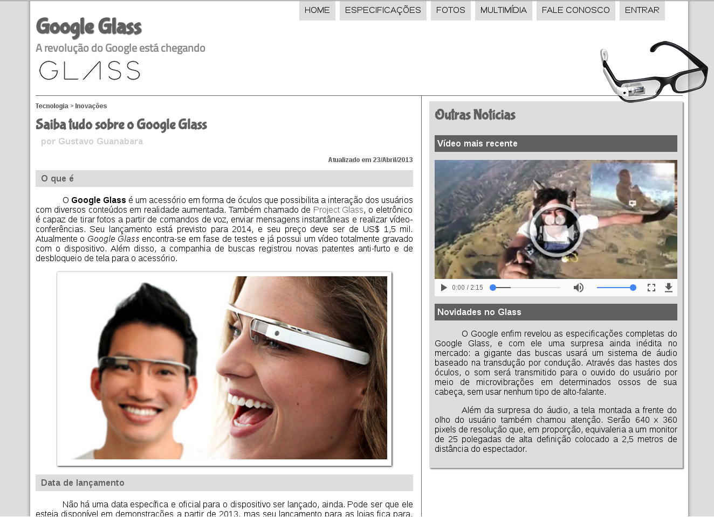

# Curso de HTML5

Site simples que foi criado utilizando as tecnologias de HTML5 + CSS3 + JavaScript. Também foi adicionado outro recurso no site que não foi abordado no curso, que é o uso de banco de dados utilizando o MySQL+PHP.

Para criar o BD use as informações do arquivo "banco_de_dados.txt".

## Página inicial do site criado

